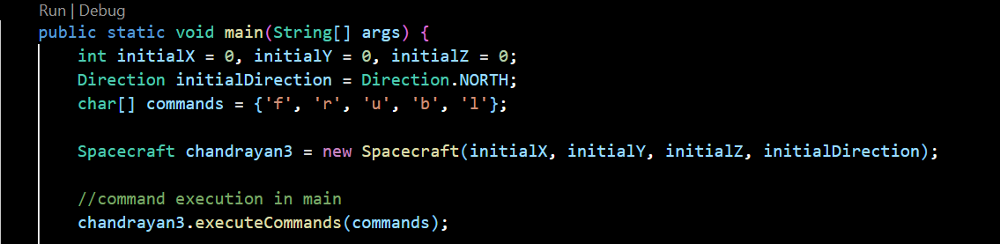

# Chandrayaan 3 Lunar Craft: Galactic Space Craft Control

## About the task

As a scientist at ISRO controlling the latest lunar spacecraft Chandrayaan 3, your task is to develop a program that translates commands sent from Earth into instructions understood by the spacecraft. The spacecraft navigates through the galaxy using galactic coordinates, represented by x, y, z coordinates (x for east or west location, y for north or south location, and z for distance above or below the galactic plane).

This project implements a Java program that simulates the movement and navigation of the Chandrayaan 3 spacecraft based on given commands. The program provides functionalities to move the spacecraft forward/backward, turn it left/right, and adjust its angle by turning it up/down.

## Getting Started 

Follow the steps below to set up and run the Chandrayaan 3 Lunar Craft program:

1. **Clone the repository:**

```bash
  git clone https://github.com/Hiralvala/chandrayan3-TDD-assetment.git
```

2. **Navigate to the project directory:**

```bash
  cd chandrayan3-TDD-assetment
```

3. **Compile and Run the Java source code:**

``` bash
  javac Spacecraft.java
```

```bash
  java Spacecraft
```

5. Modify initial parameters here for changing the directions
- Made changes here



## Usage

Before running the program, you can provide the initial position, direction, and a sequence of commands to simulate the spacecraft's movement and navigation. The program will display the final position and direction of the spacecraft after executing the commands.

### Commands

- **"f":** Move the spacecraft one step forward.
- **"b":** Move the spacecraft one step backward.
- **"r":** Turn the spacecraft 90 degrees to the right.
- **"l":** Turn the spacecraft 90 degrees to the left.
- **"u":** Turn the spacecraft upwards.
- **"d":** Turn the spacecraft downwards.

## Notes

- The spacecraft cannot move or rotate diagonally; it can only move in the direction it is currently facing.
- The spacecraft’s initial direction represents the reference frame for movement and rotation.
- The program simulates rigid movement and rotations of the spacecraft.

## Example

Given the starting point (0, 0, 0) and initial direction N, consider the following commands and their resulting final position and direction:

Commands: ["f", "r", "u", "b", "l"]
Starting Position: (0, 0, 0)
Initial Direction: N

- "f" - (0, 1, 0) - N
- "r" - (0, 1, 0) - E
- "u" - (0, 1, 0) - U
- "b" - (0, 1, -1) - U
- "l" - (0, 1, -1) - N

Final Position: (0, 1, -1)

Final Direction: N
